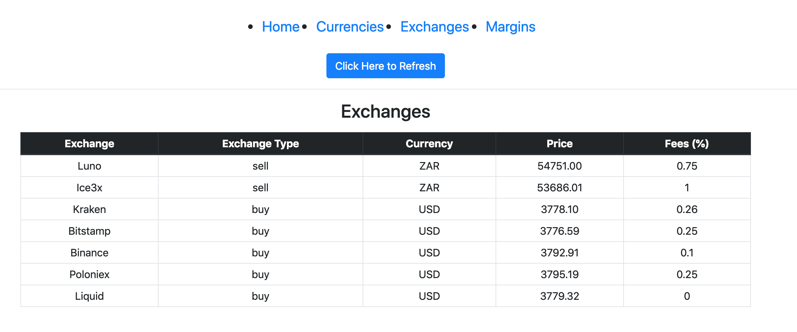

# Margin-Exchange

A dashboard displaying the ask-bid margins for Bitcoin across specific volume-intervals on the following cyptocurrency exchanges:
- Ice3x
- Luno
- Kraken
- Bitstamp
- Binance
- Poloniex
- Liquid

The weighted average of market book orders are compared across the bidding offshore vs asking locally, across the following volume intervals:
- 0.05 (BTC)
- 0.25
- 0.5
- 1
- 2
- 3

Rates and volumes are collected by an ExpressJS server, and streamed over web-sockets to subscribed clients.
Client side dashboard is built on ReactJS.
Cheerio is used for web-scraping.

